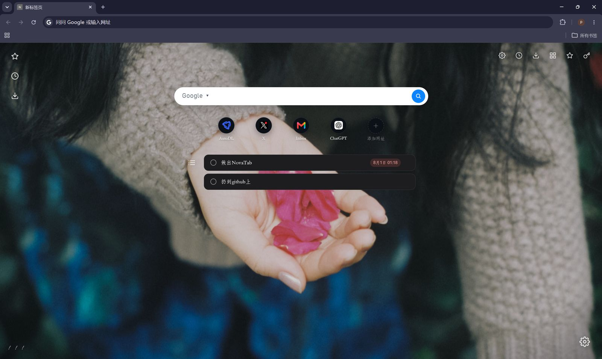

# NovaTab — 统一新标签页

> 当前版本 **v0.6.5** ｜ 仓库 https://github.com/PoesisQ/NovaTab

一个现代、极简、**纯本地运行**的新建标签页浏览器扩展（Chrome / Edge）。一套代码、统一体验，所有功能均可开关与定制。

<p align="center">
  <em>壁纸 · 搜索 · 收藏夹 · 常用网址 · 待办 · 历史 · 下载 —— 一切都由你决定</em>
</p>

## 页面布局



## 功能

| 类别 | 说明 |
|---|---|
| 🖼️ 壁纸 | 本地图片 / 预设渐变 / 自定义取色；4 种适配模式；缩放、位移、模糊、亮度、对比度、饱和度、暗角、颗粒噪点、变暗遮罩 |
| 🔍 搜索 | Google / Bing / 百度 / DuckDuckGo / 自定义 `%s` 模板；搜索建议、搜索历史、最常搜索（均可独立开关）；结果打开方式可选 |
| ⭐ 收藏夹 | 左上角图标悬停展开；可选起始根文件夹；只显示文件夹或直接铺开内容；支持收藏搜索与删除 |
| 🚀 常用网址 | 搜索栏下方一排图标（黑圆底 + 网站图标）；支持在页面或设置中**拖拽排序**，改名、隐藏与恢复在设置面板管理 |
| 📝 待办 | 宽条列表（居中 / 左 1/3 / 右 1/3；深 / 浅色主题）；最多显示 5 条、悬停滚轮滚动；可设日期时间提醒；左侧列表图标按钮打开管理面板（增 / 删 / 排序 / 备注）；可选浏览器账号云同步 |
| 🕘 历史 / ⬇️ 下载 | 左上角图标悬停查看；点击直达浏览器对应页面 |
| ⚙️ 其他 | 右上角 6 个浏览器入口；左下角自定义问候语；配置导出 / 导入；全套白描 SVG 图标 + 苹果风深色美学 + 丝滑动效 |

## 安装（开发者模式）

> 尚未上架商店，目前通过"加载已解压的扩展程序"安装。

**方式一：直接下载 Release（推荐，无需构建）**

1. 到 [Releases](../../releases) 页面下载最新版 `NovaTab-vX.Y.Z.zip`
2. 解压到任意位置（例如 `C:\NovaTab`），得到 `NovaTab` 文件夹
3. 加载到浏览器（见下方"加载到浏览器"），选择解压出的 `NovaTab` 文件夹即可

**方式二：从源码构建**

```bash
npm install
npm run build          # 产物在 .output/chrome-mv3/
npm run sync:win       # 可选：WSL 环境下复制到 C:\Users\<用户名>\NovaTab
```

**加载到浏览器**

1. Chrome：打开 `chrome://extensions` → 右上角开启「开发者模式」→「加载已解压的扩展程序」→ 选择 `NovaTab` 文件夹（Release 解压所得，或构建产物目录）
2. Edge：打开 `edge://extensions` → 左侧开启「开发人员模式」→「加载解压缩的扩展」→ 选择同一目录
3. 新建标签页即可看到效果

> ⚠️ 该文件夹会被浏览器持续引用，加载后请勿删除或移动。
> 修改代码后：重新构建 → 扩展管理页点该扩展的「⟳ 刷新」→ 关闭旧的新标签页并重开。

## 隐私

- 所有数据（设置、壁纸、待办、搜索历史）仅保存在本机浏览器内：`chrome.storage.local` + IndexedDB
- 唯一的可选联网请求是搜索建议词（可在设置中关闭）
- 无遥测、无广告、无账户；壁纸不依赖任何在线服务

## 技术栈

- [WXT](https://wxt.dev)（多浏览器扩展构建框架）+ [Vue 3](https://vuejs.org) + TypeScript
- 存储：`chrome.storage`（local / sync）+ IndexedDB
- 图标：自绘 Feather 风格白描 SVG

## 项目结构

```
src/
├── entrypoints/newtab/   # 扩展入口（新标签页）：App 根组件、样式、启动逻辑
├── types/settings.ts     # 全部设置的类型与默认值
├── core/                 # 无 UI 逻辑层：存储 / 功能注册表 / 搜索 / 待办 / 权限 / 浏览器探测
└── components/           # UI 组件：壁纸层 / 搜索栏 / 待办条 / 图标坞 / 设置面板 / 图标
```

## 开发命令

| 命令 | 作用 |
|---|---|
| `npm run dev` | 开发模式（热更新） |
| `npm run build` | 生产构建 → `.output/chrome-mv3/` |
| `npm run compile` | vue-tsc 类型检查 |
| `npm run zip` | 打包 zip |
| `npm run sync:win` | 构建产物同步到 Windows 目录（WSL 环境） |

更多细节（数据存储结构、版本历史、Windows 路径对照、已知问题）见 [HANDOVER.md](./HANDOVER.md)。
